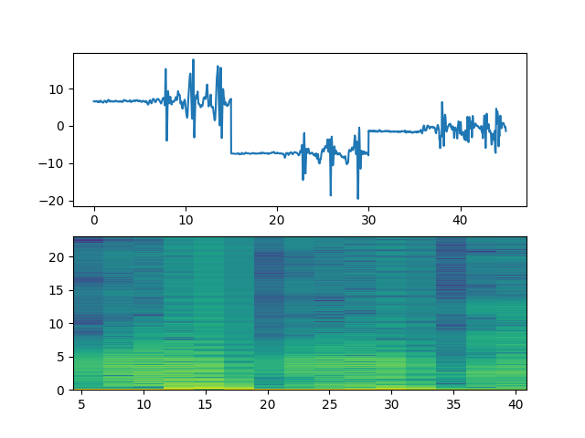

# Improving Building Accessibility using Machine learning
[Check out our website here!](https://mcchillteam.wixsite.com/maxcessibility/home-1)

This repository contains the notebook and data to accompany the implementation. This implementation was also a whack at utilizing different technology, Wolfram Mathematica. 

## Downloading Data

Before running the notebook, you'll want to download all the data you'll be using located under yhack_data.zip. 
- the folder contains multiple .tsv files for both walking on flat ground and walking up the stairs. 
- stairsdown denotes the raw dataset for walking down the stairs 
- stairsup denotes the raw dataset for walking up the stairs 
- data.tsv denotes the raw dataset for walking on flat ground

To clone the repository: 
  ```bash 
  git clone https://github.com/kmualim/yhack
  ```
Unzip the data file provided and run the preproceessing script on the corresponding raw datasets 
  ``` bash 
  bash process.bash
  ```
- process.bash proceeds to isolate the x,y,z coordinates of the given activity for input into our algorithm. 
- the output consists of (stair/walk)_(x/y/z)_.csv files and these x,y,z coordinates were then subsequently concatenated to produce a spectogram <br>


Figure 1: Spectrogram of "Walk"
  
## Requirements and Installation

In order to run the notebook, you'll need 
* [Wolfram Mathematica](https://reference.wolfram.com/language/tutorial/InstallingMathematica.html) 

